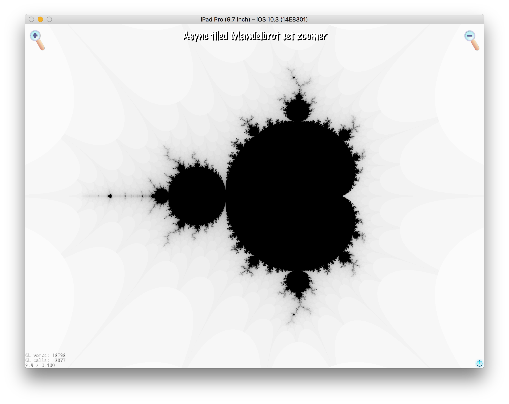
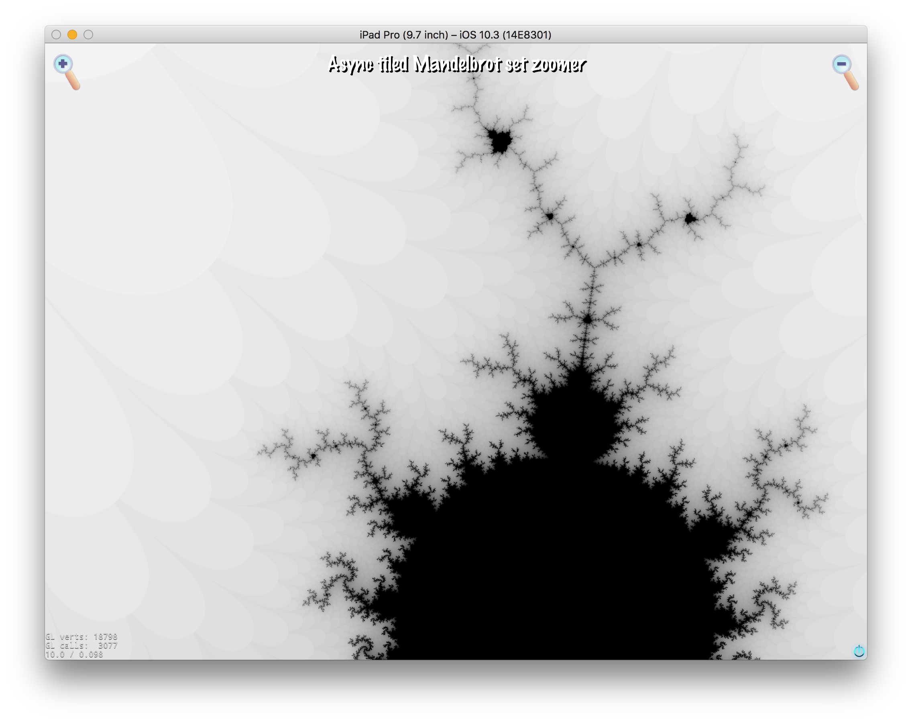
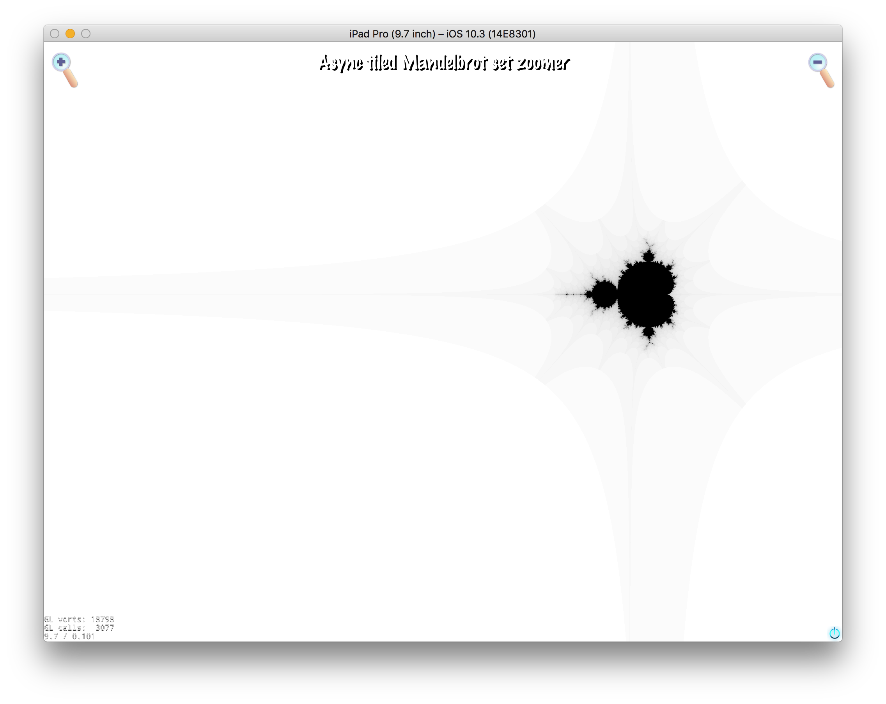
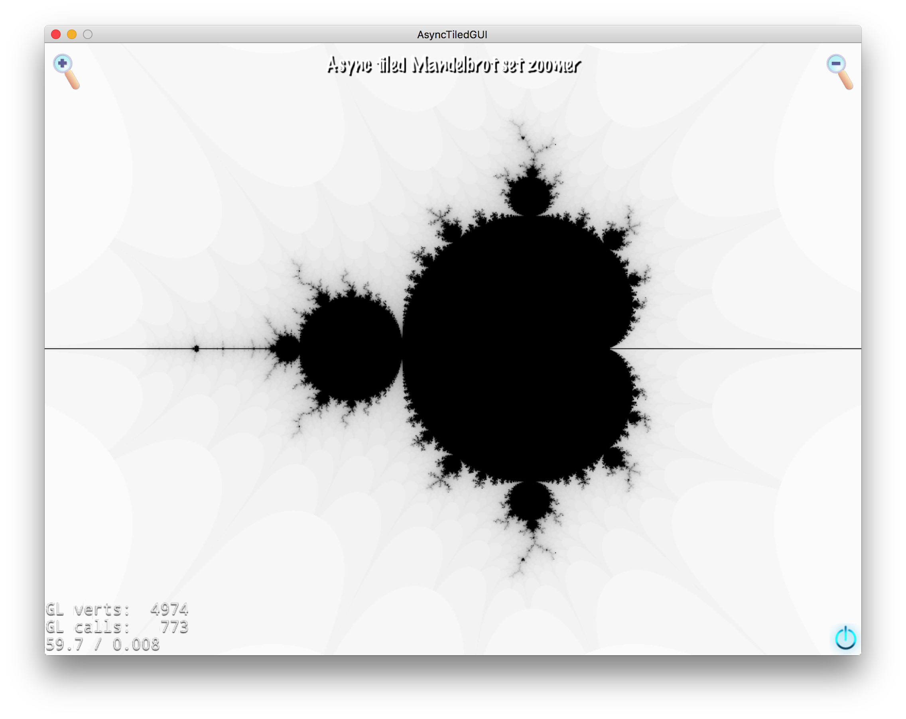
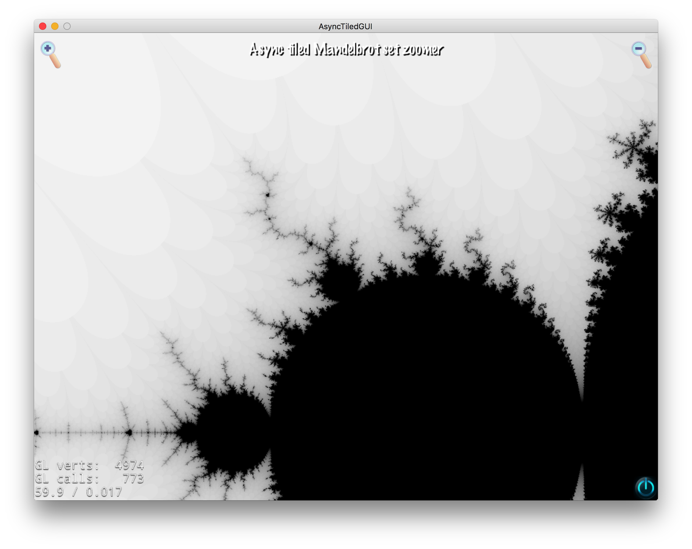

# Async Tiled Mandelbrot set Zoomer
A Cocos2D-x C++ 14 App using std::async to generate tiles of the Mandelbrot set in the background.
Has been successfully built for MacOS and iPad pro 9.7".

## Screenshots

### Running on iPad Pro 9.7"

These were taken in the emulator but it runs on hardware too.

### Running on a MacBook Pro

## The Code
Code of interest is found under the directories:

* `/Classes`
* `/async_tiled`
